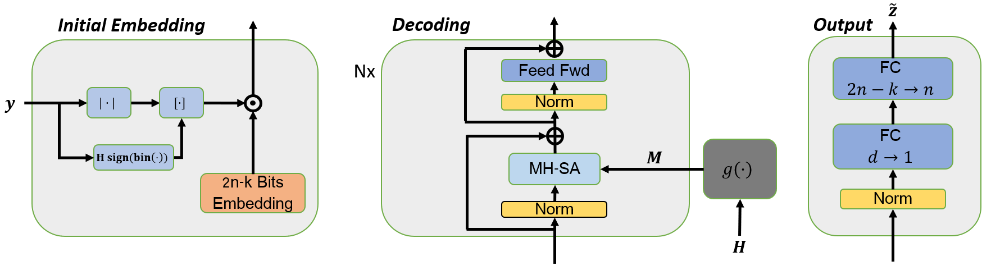

# Error Correction Code Transformer

Implementation of the Error Correction Code Transformer described in ["Error Correction Code Transformer (NeurIPS 2022)"](https://arxiv.org/abs/2203.14966).

## Abstract

Error correction code is a major part of the communication physical layer, ensuring the reliable transfer of data over noisy channels. Recently, neural decoders were shown to outperform classical decoding techniques. However, the existing neural approaches present strong overfitting due to the exponential training complexity, or a restrictive inductive bias due to reliance on Belief Propagation. Recently, Transformers have become methods of choice in many applications thanks to their ability to represent complex interactions between elements. In this work, we propose to extend for the first time the Transformer architecture to the soft decoding of linear codes at arbitrary block lengths. We encode each channel's output dimension to high dimension for better representation of the bits information to be processed separately. The element-wise processing allows the analysis of the channel output reliability, while the algebraic code and the interaction between the bits are inserted into the model via an adapted masked self-attention module. The proposed approach demonstrates the extreme power and flexibility of Transformers and outperforms existing state-of-the-art neural decoders by large margins at a fraction of their time complexity.

## Install
- Pytorch

## Script
Use the following command to train, on GPU 0, a 6 layers ECCT of dimension 32 on the POLAR(64,32) code:

`python Main.py --gpu=0 --N_dec=6 --d_model=32 --code_type=POLAR --code_n=64 --code_k=32`

## Reference
    @article{choukroun2022error,
      title={Error Correction Code Transformer},
      author={Choukroun, Yoni and Wolf, Lior},
      journal={arXiv preprint arXiv:2203.14966},
      year={2022}
    }
    
## License
This repo is MIT licensed.
